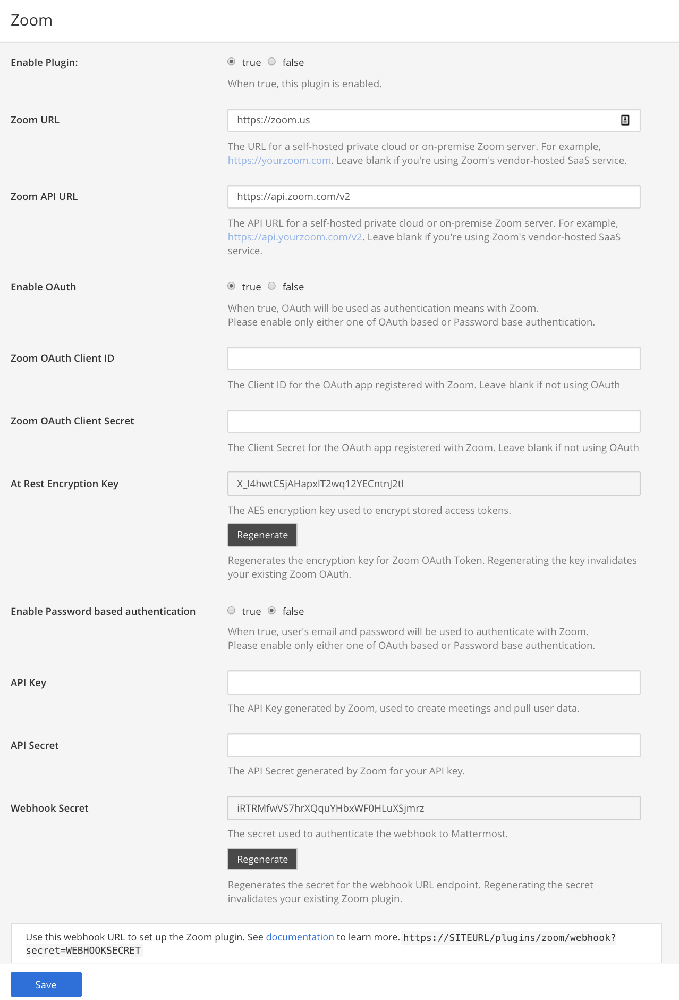

# Mattermost Zoom Plugin 

Start and join voice calls, video calls and use screen sharing with your team members via Zoom.

Once enabled, clicking a video icon in a Mattermost channel invites team members to join a Zoom call, hosted using the credentials of the user who initiated the call.

Zoom Plugin
================================

**Usage**

Once enabled, clicking a video icon in a Mattermost channel invites team members to join a Zoom call, hosted using the credentials of the user who initiated the call.

Zoom Setup Guide
-----

1. Go to **System Console > Plugins > Zoom** to configure the Zoom Plugin.

2. If you're using a self-hosted private cloud or on-premise Zoom server, enter the **Zoom URL** and **Zoom API URL** for the Zoom server, for example `https://yourzoom.com` and `https://api.yourzoom.com/v2` respectively. Leave blank if you're using Zoom's vendor-hosted SaaS service.  You will need a paid Zoom account to use the plugin.

3. Set the **API Key** and **API Secret**, generated by Zoom and used to create meetings and pull user data:

  - Go to https://marketplace.zoom.us/ and log in.
  - In the top left click on **Develop** and then **Build App**.
  - Enter a name for your app and disable **Intend to publish this app on Zoom Marketplace**.
  - Choose **Account-level app** as the app type.
  - Select **JWT API Credentials** as authentication type.
  - Click **Create**.
  - Enter the **Company Name** and **Developer Contact Information** for your app.
  - Go to the **App Credentials** tab on the left. Here you'll find your **API Key** and **API Secret**.
  - Paste the **API Key** and **API Secret** into the fields in the System Console, and hit **Save**.
  

To generate an **API Key** and **API Secret** requires a [Pro, Business, Education, or API Zoom plan](https://zoom.us/pricing).

4. Set the **OAuth ClientID** and **OAuth Secret**, generated by Zoom and used to create meetings and pull user data:

  - Go to https://marketplace.zoom.us/ and log in.
  - In the top left click on **Develop** and then **Build App**.
  - Select **OAuth** in **Choose your app type** section.
  - Enter a name for your app and disable **Intend to publish this app on Zoom Marketplace**.
  - Choose **Account-level app** as the app type.
  - Click **Create**.
  - Enter the **Company Name** and **Developer Contact Information** for your app.
  - Go to the **App Credentials** tab on the left. Here you'll find your **Client ID** and **Client Secret**.
  - Enter a Valid **Redirect URL for OAuth** and add the same url under **Whitelist URL**.
  - Paste the **Client ID** and **Client Secret** into the fields in the System Console, and hit **Save**.
  - Generate an **Encryption Key** to save the encryped tokens.

5. Enable settings for [overriding usernames](https://docs.mattermost.com/administration/config-settings.html#enable-integrations-to-override-usernames) and [overriding profile picture icons](https://docs.mattermost.com/administration/config-settings.html#enable-integrations-to-override-profile-picture-icons).

6. Activate the plugin at **System Console > Plugins > Management** by clicking **Activate** for Zoom.

Once activated, you will see a video icon in the channel header. Clicking the icon will open a drop-down menu with three actions you can take: **Start Zoom Meeting Now**, **Start Zoom Meeting with Topic**, and **Share Zoom Meeting**.

Note
----
   Users will need to sign-up for their own Zoom account using the same email address that they use for Mattermost. If the user attempts to start a Zoom meeting without a Zoom account, they will see the following error message: "We could not verify your Mattermost account in Zoom. Please ensure that your Mattermost email address matches your Zoom email address."
   In addition, the user must be added to the admin's Zoom account to quickly start a meeting without having to share a personal meeting ID.

## Development

This plugin contains both a server and web app portion.

Use `make dist` to build distributions of the plugin that you can upload to a Mattermost server for testing.

Use `make check-style` to check the style for the whole plugin.

### Server

Inside the `/server` directory, you will find the Go files that make up the server-side of the plugin. Within there, build the plugin like you would any other Go application.

### Web App

Inside the `/webapp` directory, you will find the JS and React files that make up the client-side of the plugin. Within there, modify files and components as necessary. Test your syntax by running `npm run build`.
